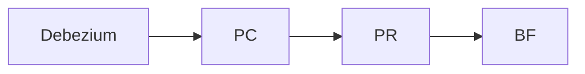
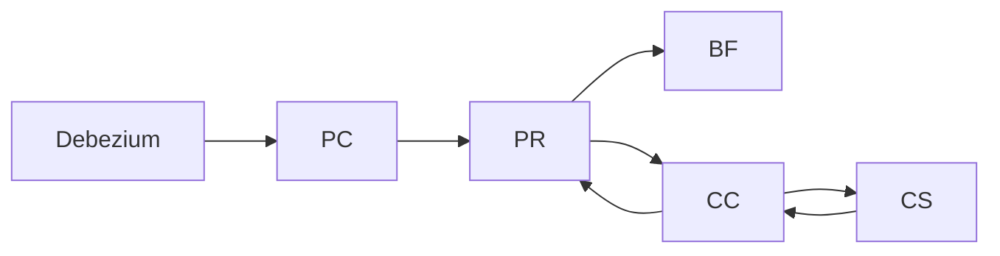
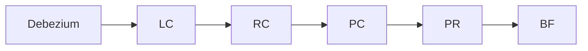
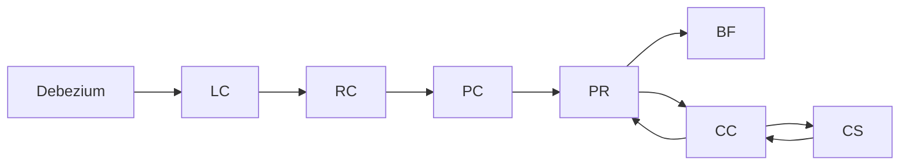

# postevent
A library to publish and receive events using postgres and grpc

## features
* Publish events based on the [cloudevents spec](https://github.com/cloudevents/spec/blob/main/cloudevents/spec.md)
  * Events are persisted in the source database
* Connect consumers either in-process or from a remote node (via grpc)
* Receive events in order (by `subject`)
* Receive all previous events on first connect
* Receive new events in real time 

TODO
Create a catchup mechanism
* Request a batch of messages from the server (starting from?)
* Write each message to the consumer
* Stop when the catchup mechanism detects that it is overwriting the live messages

TODO
Create a processor
* Verifies that there are no gaps in the event sequence (check the sequence for the earliest unprocessed event until this one)
* Verifies that there are no earlier unprocessed events for the same subject

DB Debezium DONE
LC Local Consumer DONE
RC Remote Consumer 
PC Persistent Consumer DONE
PR Processor 
BF Business Function Ongoing
CC Catchup Client 
CS Catchup Server

Local constant consumption

Local constant consumption with catchup

Remote constant consumption

Remote constant consumption with catchup

