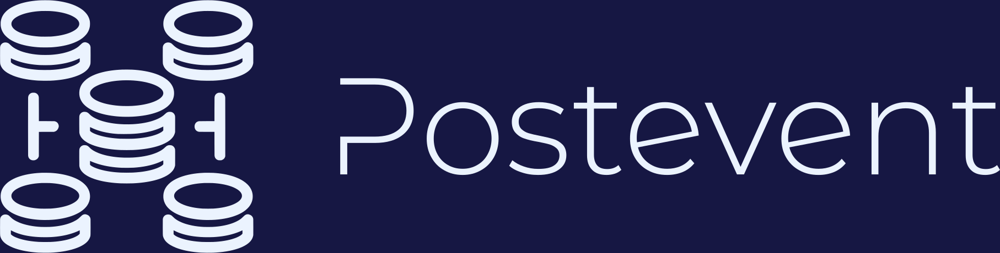
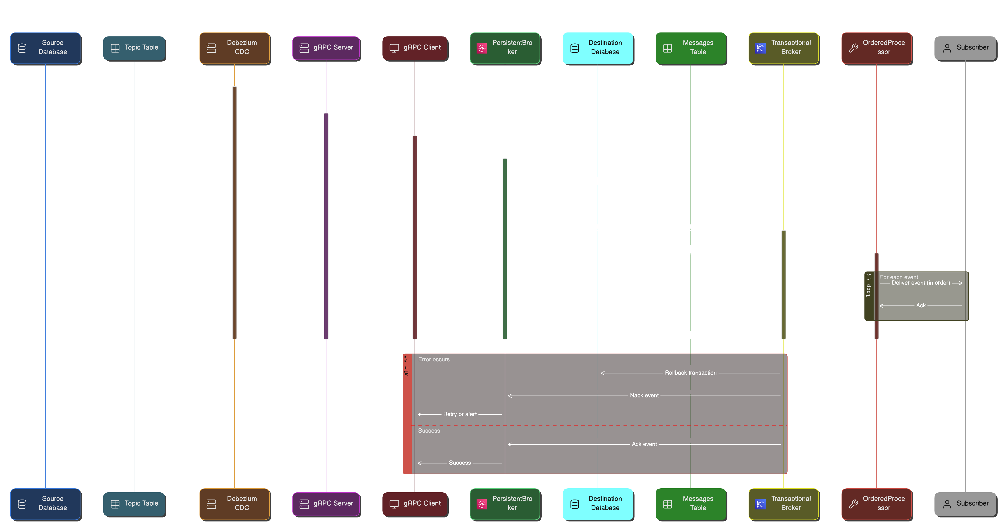

<picture>
  <source media="(prefers-color-scheme: dark)" srcset="assets/postevent-dark.png">
  <source media="(prefers-color-scheme: light)" srcset="assets/postevent-light.png">
  
</picture>

# Postevent

[](https://github.com/p14n/postevent/actions)
[](LICENSE)
[](https://github.com/yourusername/postevent/releases)

A reliable event publishing and consumption system using PostgreSQL and gRPC, following the CloudEvents specification.

## Features

- Event Publishing:
  - CloudEvents specification compliance
  - PostgreSQL persistence
  - Debezium change data capture integration
- Event Consumption:
  - In-process and remote consumers (via gRPC)
  - Ordered event delivery by subject
  - Automatic catch-up for missed events
  - Historical event replay

## Quick Start

### Prerequisites

- Java 21 or higher
- PostgreSQL 13 or higher
- Docker (optional)

### Installation

#### Gradle
```groovy
implementation 'com.p14n:postevent:1.0.0'
```

#### Maven
```xml
<dependency>
    <groupId>com.p14n</groupId>
    <artifactId>postevent</artifactId>
    <version>1.0.0</version>
</dependency>
```

### Basic Usage

Postevent can be used in both in-process and client/server modes, depending on your architecture.  Use LocalPersistentConsumer for in-process, and ConsumerServer/RemotePersistentConsumer for client/server.

```java
// Start a consumer server
var config = new ConfigData("myapp", Set.of("orders"), "localhost", 5432, 
    "postgres", "postgres", "postgres", 10);
var server = new ConsumerServer(dataSource, config, OpenTelemetry.noop());
server.start(8080);

// Create a remote consumer
try (RemotePersistentConsumer client = new RemotePersistentConsumer(OpenTelemetry.noop(), 10)) {
    client.start(Set.of("orders"), dataSource, "localhost", 8080);
    client.subscribe("orders", message -> {
        System.out.println("Received: " + message);
    });
}

// Publish an event
Publisher.publish(Event.create(...), dataSource, "orders");
```

See `src/main/java/com/p14n/postevent/example` for more examples.

## Architecture

<picture>
  
</picture>

## Configuration

| Parameter | Description | Default | Required |
|-----------|-------------|---------|----------|
| affinity | Unique identifier for the application (ie node of cluster) | - | Yes |
| topics | Set of topic names to consume | - | Yes |
| dbHost | PostgreSQL host | - | Yes |
| dbPort | PostgreSQL port | - | Yes |
| dbUser | PostgreSQL username | - | Yes |
| dbPassword | PostgreSQL password | - | Yes |
| dbName | PostgreSQL database name | - | Yes |
| overrideProps | Additional properties for Debezium | - | No |
| startupTimeoutSeconds | Timeout for Debezium startup | 30 | No |
| pollInterval | Poll interval for Debezium | 500 | No |

## Copying mechanism
Tables are created on startup in the `postevent` schema.  The tables are named after the topic names.  When a new row/event is added to the table, Debezium will notify Postevent.  The following steps are then taken:
* The PeristentBroker will copy the event to the `messages` table.  If the event is already in the `messages` table, it will be ignored.
* The TransactionalBroker starts a database transaction that spans the status of the and publishing to your subscriber.
* The OrderedProcessor ensures that all prior events (by subject) have been processed before processing the current event.

### Catchup Mechanism
Messages are copied to the destination server as fast as possible.  Under normal conditions the process above is followed.  However, if messages arrive out of order, or are missing (for example if the server wasn't connected when they were published), the CatupService will be triggered:
* The CatchupService will check for gaps in the sequence of events.  If a gap is found, it will fetch the missing events from the source server and copy them to the destination server.  This process will continue until all gaps are filled.
* Once the CatchupService has filled all gaps, it will trigger the UnprocessedSubmitter to process the events.

The contiguous high water mark (HWM) is used to track the last consistent event that arrived.  This is used to determine if there are any gaps in the sequence of events.  The HWM is updated after each event is copied to the destination server, only if the event is contiguous (ie all previous events have arrived).  It is safe to delete all rows in the messages table before the HWM for that topic.  This may be done automatically in the future.

### Multiple Topics
A ConsumerServer can be configured to consume multiple topics.  Each topic will have its own table in the `postevent` schema.  Each client can subscribe to any subset of these topics.  The client will receive events for all topics it is subscribed to.

## Performance
Tested on fargate 0.5vCPU/1GB with RDS db.t4g.micro
- Throughput: 200 events/second
- Latency: Y ms average

## Contributing

1. Fork the repository
2. Create your feature branch (`git checkout -b feature/amazing-feature`)
3. Commit your changes (`git commit -m 'Add amazing feature'`)
4. Push to the branch (`git push origin feature/amazing-feature`)
5. Open a Pull Request

## Development Setup

```bash
# Clone the repository
git clone https://github.com/yourusername/postevent.git

# Start PostgreSQL
docker run --name postevent -v ./app/postgres:/docker-entrypoint-initdb.d \
    -e POSTGRES_PASSWORD=postgres -e POSTGRES_USER=postgres \
    --publish 5432:5432 -d postgres

# Build the project
./gradlew build
```

## Testing

```bash
./gradlew test
```

## Versioning

We use [SemVer](http://semver.org/) for versioning. For available versions, see the [releases page](https://github.com/p14n/postevent/releases).

## License

This project is licensed under the MIT License - see the [LICENSE](LICENSE) file for details.

## Support

- Create an [Issue](https://github.com/yourusername/postevent/issues)
- Join our [Discord/Slack] community
- Email: support@yourdomain.com

## Acknowledgments

- [Debezium](https://debezium.io/) for change data capture
- [CloudEvents](https://cloudevents.io/) for event specification
- [gRPC](https://grpc.io/) for remote communication

## Project Status

Active development, production-ready.
